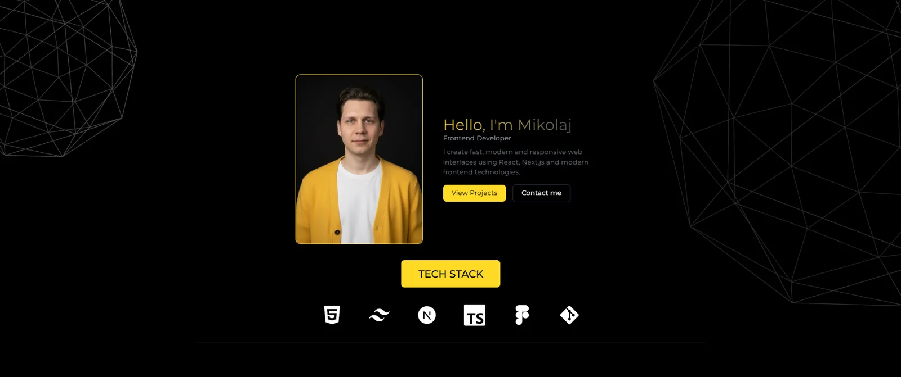

# Mikołaj Germanenka — Developer Portfolio

A responsive portfolio presenting my frontend experience, selected projects, and
growing full-stack skill set. The site is designed for recruiters and engineering
teams who want a concise view of how I approach product interfaces, accessibility,
performance, and maintainable code.

**Live site:** [portfolio-luvtorn.vercel.app](https://portfolio-luvtorn.vercel.app/)



## Highlights

- Recruiter-focused introduction, experience timeline, and project case studies
- Full-stack Job Tracker and Cookly projects with product and engineering highlights
- Responsive layouts for mobile, tablet, and desktop
- Accessible navigation, form labels, keyboard focus, and reduced-motion support
- Session-aware introduction with an immediate skip option
- Optimized Next.js images, metadata, sitemap, robots rules, and structured data

## Featured Project: Job Tracker

Job Tracker is a full-stack application for managing job applications and
recruitment progress in one place. It supports vacancies and candidates,
interview scheduling, document sharing, notes, contacts, reminders, dashboards,
hiring funnels, and job-search statistics.

- [Live demo](https://job-tracker-phi-swart.vercel.app/)
- [Source code](https://github.com/luvtorn/Job-Tracker)

Its stack includes Next.js, React, TypeScript, Prisma, PostgreSQL, TanStack Query,
JWT authentication with rotating refresh tokens, HttpOnly cookies, Server-Sent
Events, Cloudinary, internationalization, and automated quality checks.

## Cookly

Cookly is a multilingual recipe platform where visitors can discover and search
recipes, explore public creator profiles, and publish their own recipes. The
application also includes a protected editorial studio for curation and review.

- [Live demo](https://cookly-proj.vercel.app/en)
- [Source code](https://github.com/luvtorn/Cookly)

It uses Next.js, TypeScript, Prisma, PostgreSQL, Tailwind CSS, and Cloudinary,
with automated checks using Vitest, Playwright, and GitHub Actions.

## Technology

- Next.js 16 App Router and React 19
- TypeScript and Tailwind CSS
- Framer Motion and Lenis
- React Three Fiber and Drei
- Formspree contact endpoint
- ESLint and the Next.js production toolchain

## Architecture

The application uses the Next.js App Router. Portfolio content is defined in a
typed data module, while each major page area is implemented as an independent
component. Static metadata, sitemap, robots configuration, and JSON-LD are
generated by the application. Interactive client components are limited to
navigation, motion, the introduction, the contact form, and the optional desktop
3D decoration.

```text
src/
├── app/
│   ├── components/      # Page sections and interactive UI
│   ├── layout.tsx       # Metadata, structured data, and global shell
│   ├── page.tsx         # Portfolio composition
│   ├── robots.ts
│   └── sitemap.ts
└── data.tsx             # Typed projects and experience content
```

## Local Development

Requirements: Node.js 20 or newer and npm.

```bash
git clone https://github.com/luvtorn/portfolio-luvtorn.git
cd portfolio-luvtorn
npm install
npm run dev
```

Open [http://localhost:3000](http://localhost:3000).

### Quality checks

```bash
npm run lint
npm run typecheck
npm run build
```

## Deployment

The production site is deployed on Vercel. Pushing to the configured production
branch triggers a new build and deployment.

## Contact

**Mikołaj Germanenka** — Frontend Developer based in Poznań, Poland

- [GitHub](https://github.com/luvtorn)
- [LinkedIn](https://www.linkedin.com/in/mikolaj-germanenka)
- [Email](mailto:kolyangermanenko@gmail.com)
- [Résumé](./public/resume.pdf)
